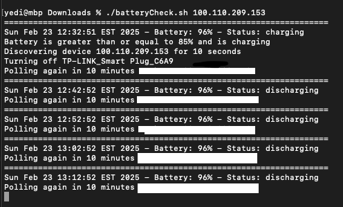

# kasa-mac-battery
Scripts and instruction to set up a kasa smart plug to automatically toggle based on macbook battery percentages



<u>Tools needed:</u> Kasa Smart Plug - KP125  
(May work with other models but have only tested in this one)

Applicable for MacOS  
Tested on MacOS version : Sequoia 15.3.1

<b>Step 1:</b>

Install Python or Python3
https://www.python.org/downloads/
or install any other way you choose.  
Make sure python3 is added to path variable in your environment.

Latest version at this time is 3.13 so pip3 should come shipped with current version

<b>Step 2:</b>

Install kasa's python api for discovering and controlling TPLink's smart home devices

```
pip3 install python-kasa
```

Make sure kasa is added as a path variable to your environment.
You can test by running

```
kasa --version
```

<b>Step 3:</b>

Plug in your smart plug into an outlet. If it's out of the box, it may not need to reset.  
But if the kasa fails to discover it, it may need to perform a factory reset by pressing the button for 10 seconds.  
<b><i>(Has to be 10 seconds)  </i></b>

Once it's ready, run

```
kasa discover
```

This will discover the device and give you a summary of it like this

```
== Bulb McBulby - L530 ==
Host: 192.0.2.123
Port: 80
Device state: False
Time:         2024-06-22 15:42:15+02:00 (tz: {'timezone': 'CEST'}
Hardware:     3.0
Software:     1.1.6 Build 240130 Rel.173828
MAC (rssi):   5C:E9:31:aa:bb:cc (-50)
== Primary features ==
State (state): False
Brightness (brightness): 11 (range: 0-100)
Color temperature (color_temperature): 0 (range: 2500-6500)
Light effect (light_effect): *Off* Party Relax

== Information ==
Signal Level (signal_level): 2
Overheated (overheated): False
Cloud connection (cloud_connection): False
Update available (update_available): None
Device time (device_time): 2024-06-22 15:42:15+02:00

== Configuration ==
HSV (hsv): HSV(hue=35, saturation=70, value=11)
Auto update enabled (auto_update_enabled): False
Light preset (light_preset): *Not set* Light preset 1 Light preset 2 Light preset 3 Light preset 4 Light preset 5 Light preset 6 Light preset 7
Smooth transition on (smooth_transition_on): 2 (range: 0-60)
Smooth transition off (smooth_transition_off): 20 (range: 0-60)

== Debug ==
Device ID (device_id): soneuniqueidentifier
RSSI (rssi): -50 dBm
SSID (ssid): HomeNet
Current firmware version (current_firmware_version): 1.1.6 Build 240130 Rel.173828
Available firmware version (available_firmware_version): None
```

Take note of the host address - <b>192.0.2.123</b>

<b>Step 4:</b>

Copy battery-check.sh script in the repo and modify it to your desired configurations.  
The script polls the battery percentage from power management in your macOS and greps the status.  
If it's below a certain threshold, it will run a kasa command to toggle on the smart plug,  
and likewise if it reached a certain threshold, it will shut it off.  
The polling interval is controlled by a sleep command.  

```
upperChargeLimit = when to stop if battery hits a certain percentage like 90 = 90%
lowerChargeLimit = when to start if battery falls below a certain percentage like 50 = 50%
```

To run the script, simply modify it's permission like so
```
chmod 777 <yourdirectory>/battery-check.sh;
```
and run it with the host as argument   
```
./<yourdirectory>/battery-check.sh 192.0.2.123 <--- in this example it's 192.0.2.123 from step 3
```

You can also modify the polling interval by changing how long the script sleeps for.  
```
sleep 600 = pause for 600 seconds or 10 minutes
```
